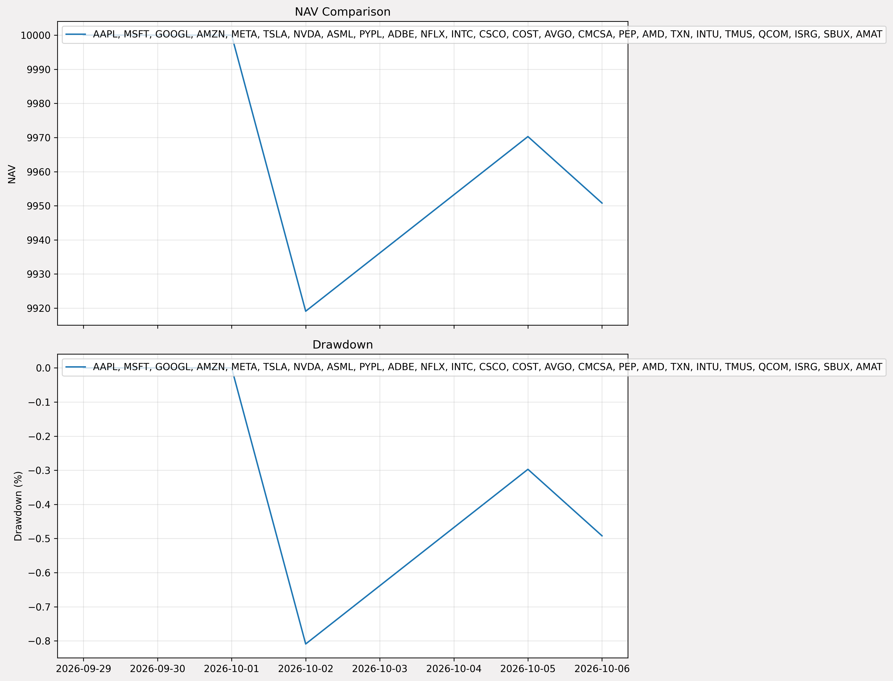

# Quant Dev - Quantitative Trading & AI Agent

> From backtest to live AI-driven orders — a complete quantitative trading stack in Python.

[](https://www.python.org/)
[](https://github.com/ipython168/quant-dev/actions)
[](https://fastapi.tiangolo.com/)
[](LICENSE)
[](https://www.linkedin.com/in/ka-on-yip-5775b0429/)

A complete quantitative trading system built from scratch — combining a production-grade backtesting engine with an AI-driven trading agent. Supports multi-strategy portfolios, multiple order types, comprehensive performance metrics, and a RESTful API.

---

## 🎯 Key Features

- **📊 Data Management**: Automated download, caching, and normalization of Yahoo Finance data (daily / minute bars)
- **⚙️ Strategy Backtesting**: Support for **Market / Limit / Stop Orders** with full **Gap Handling**
- **📈 Portfolio Management**: Multi-strategy weighting, leverage, NAV/ATH/DD calculations
- **🤖 AI Trading Agent**: Transformer-based agent generating order suggestions (action + price) from OHLC data
- **📡 RESTful API**: FastAPI service with auto-generated Swagger documentation
- **🧪 Testing & CI**: 38 unit tests, automated via GitHub Actions

---

## 🏗️ System Architecture
```
DataManager → Strategy → Portfolio → FastAPI → Swagger UI
     ↓            ↓          ↓          ↓
  (Data)     (Trading)   (Portfolio)  (API Service)
                  ↑
            AI Trading Agent
          (generates orders)
```

---


## 📸 Screenshots

### Backtest Result


### Equity Curve

 

---

## 🤖 AI Trading Agent

An AI-driven trading agent that generates order suggestions (buy/sell, order type, price) from OHLC data.

**Components:**
- `trade_agent.py` — Agent interface (generates orders)
- `network.py` — Model architecture

**Performance (V20, proprietary):**
- [V20 Backtest Report (2010-2026)](docs/v20_backtest.md) — Train / OOS performance
- [Paper Trading Report](docs/paper_trade.md) — Live paper trading since 2026-9-29



> **Note:** V20 is the production model. Its weights are proprietary and not
> publicly available. The demo below uses a public Transformer checkpoint (v14)
> to demonstrate the inference interface.

**Highlights:**
- AI outperforms Teacher model on both Sharpe and Calmar in OOS
- AI achieves lower max drawdown (27.5%) than SH benchmark (39.3%)
- Universe: NQ25, rebalanced every 6 months


### AI Order (demo model)

```python
from quant_dev.ai import TradeAgent, AIContext
from quant_dev.data.manager import DataManager

# 1. Prepare OHLCV data (last 300 bars)
dm = DataManager()
df = dm.get_or_fetch("AAPL", timeframe="1d", days=450)
ohlcv = df[["Open", "High", "Low", "Close", "Volume"]].tail(300)

# 2. Load demo agent from HuggingFace Hub
agent = TradeAgent.from_pretrained("ipython168/trader-transformer-v14")

# 3. Generate AI order
context = AIContext(ohlcv=ohlcv, current_position=0, direction="buy")
order = agent.compute_action(context)

print(order.action)   # "entry" / "exit" / "hold"
print(order.price)    # e.g. 320.53
```

Demo models:
| Model ID | Architecture |
|----------|-------------|
| ipython168/trader-transformer-v14 | Transformer (public demo) |

---

## 🚀 Quick Start

### 1. Installation
```bash
git clone https://github.com/ipython168/quant-dev.git
cd quant-dev
pip install -e .
```

### 2. Set ngrok token
```bash
export NGROK_AUTHTOKEN="your_ngrok_authtoken"
```

### 3. Test with Colab / Jupyter
```python
from quant_dev.strategies import create_golden_and_death_cross_strategy
from quant_dev.data.manager import DataManager
from quant_dev.backtest.strategy import Strategy, StrategyOption 
from quant_dev.backtest.portfolio import Portfolio
import pandas as pd, numpy as np

# Download data & Create strategy
dm = DataManager()
tickers = ["AAPL", "TSLA"]
strats = []
for ticker in tickers: 
    df = dm.get_or_fetch(ticker, timeframe="1d", days=1000, force_download=True)
    strat = create_golden_and_death_cross_strategy(
        ticker=ticker,
        sma_fast=20,
        sma_slow=50,
        direction="buy",
        entry_order_type="stop",
        exit_order_type="stop",
        gap_entry="open",
        gap_exit="open",
    )
    strats.append(strat)
 
# Create Portfolio
pf = Portfolio(
    strategies=strats,
    weights=[0.6, 0.4],      # 60% AAPL, 40% TSLA
    leverage=1.0,
    initial=100000.0,
)    

# Run backtest
pf.backtest() 
print(pf.generate_report())

# Get trade log
trade_log = pf.get_trade_log()
print(trade_log[['nav', 'cash', 'trade_pnl']].head(5))

# View nav / dd
fig = pf.plot()


```

### 4. Start API Server
```bash
# With ngrok (mobile / remote testing)
python -m quant_dev

# Local development
python -m quant_dev --fg

# Run vm run
chmod +x ./scripts/run.sh ./scripts/stop.sh ./scripts/status.sh
./scripts/run.sh
```

---

## 📡 API Demo

After starting the server, open `/docs` in your browser to see Swagger UI:

```
https://your-ngrok-url.ngrok-free.dev/docs
```

### POST /backtest
```json
{
    "tickers": ["AAPL", "TSLA"],
    "strategy": "golden_cross",
    "params": {"sma_fast": 20, "sma_slow": 50},
    "weights": [0.6, 0.4],
    "initial": 100000,
    "days": 500
}
```

**Sample Backtest Results:**
```
Total Return: 55.36%
Annual Return: 17.62%
Sharpe Ratio: 0.76
Max Drawdown: -24.07%
```

### Swagger UI 
<a href="images/swagger.png"></a>

---

## 📂 Project Structure

See [repo root](.) for full structure.

Key modules:
- `src/quant_dev/` — Core library (data, backtest, strategies, ai, api)
- `docs/` — Written reports (v20 backtest, paper trading)
- `reports/` — Charts & trade logs (PNG, CSV)
- `tests/` — Unit tests (38 tests)


---

## 🛠️ Tech Stack

| Category | Tools |
|------|------|
| Language | Python 3.12 |
| Data | Pandas, NumPy, yfinance |
| API | FastAPI, Uvicorn |
| Testing | pytest, GitHub Actions |
| Deployment | ngrok, Bash |
| Management | pyproject.toml, pip |

---

## 📊 Test Coverage

| Module | Tests | Status |
|------|--------|------|
| DataManager | 7 | ✅ PASS |
| Strategy | 12 | ✅ PASS |
| Portfolio | 11 | ✅ PASS |
| API | 8 | ✅ PASS |
| **Total** | **38** | ✅ **全部 PASS** |

---

## 📄 License
 
[](LICENSE)

---

## 🙋‍♂️ About Me

Passionate about **Python development** and **quantitative trading**, and **AI-driven systems**. This project is a complete quantitative trading stack built from scratch, from backtest to live AI agent — showcasing my **engineering capabilities** and **quantitative mindset**.


- 🔗 GitHub: [ipython168-git](https://github.com/ipython168/quant-dev)
- 💼 LinkedIn: [LinkedIn](https://www.linkedin.com/in/kaonquant/)

---

## ⭐ If this project helps you, please give it a Star!


 
