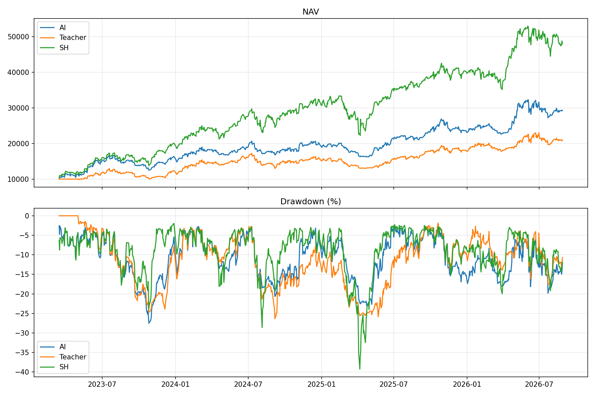
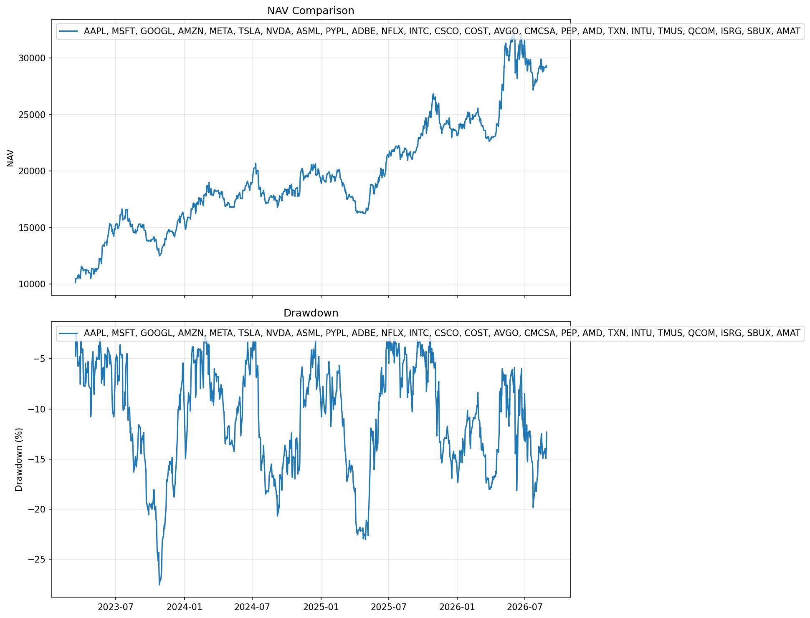
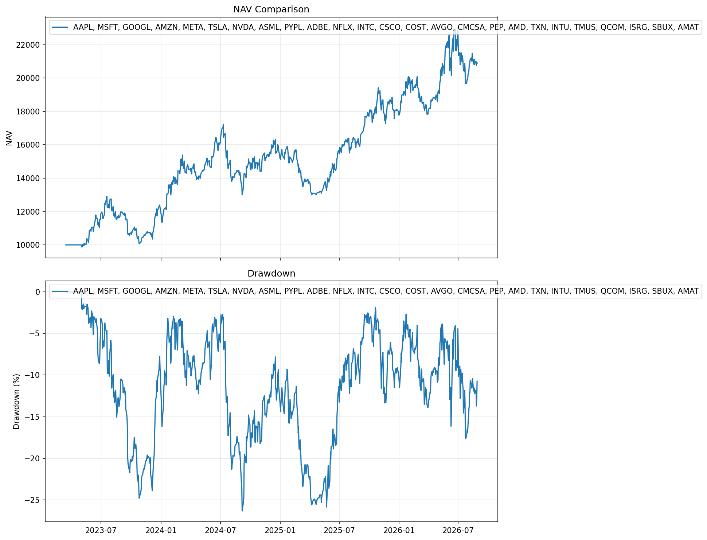
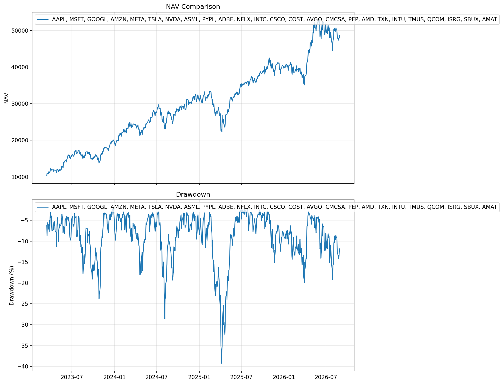

# V20 Model — Backtest Report

## Model Overview

| Item | Detail |
|------|--------|
| **Model ID** | `trader-transformer-v20` |
| **Architecture** | Transformer-based policy network |
| **Training Mode** | Supervised |

---

## Configuration

| Parameter | Value |
|-----------|-------|
| **Universe** | NQ25 (top 25 Nasdaq stocks) |
| **Universe Rebalance** | Every 6 months |
| **Train Period** | 2010 – 2021 |
| **OOS Period** | 2022 – 2026 |
| **Data Source** | 2010-2021 (train), 2022-2026 (OOS) |

---

## Test Portfolio Performance

### Training Set

| Metric | AI | Teacher | SH |
|--------|-----|---------|-----|
| **Final NAV** | 487,253 | 371,960 | 545,194 |
| **CAGR** | 43.3% | 39.8% | 44.9% |
| **Sharpe** | **1.42** | 1.34 | 1.29 |
| **Calmar** | **1.21** | 0.99 | 0.98 |
| **Max Drawdown** | 33.1% | 37.7% | 43.5% |
| **Win Rate** | 51.2% | 46.0% | — |
| **Total Trades** | 565 | 637 | 50 |

### Out-of-Sample Set

| Metric | AI | Teacher | SH |
|--------|-----|---------|-----|
| **Final NAV** | 29,222 | 20,899 | 48,007 |
| **CAGR** | 36.0% | 23.9% | 56.2% |
| **Sharpe** | **1.23** | 0.96 | 1.45 |
| **Calmar** | **1.27** | 0.94 | 1.29 |
| **Max Drawdown** | 27.5% | 26.3% | 39.3% |
| **Win Rate** | 37.2% | 40.6% | — |
| **Total Trades** | 215 | 251 | 50 |

> **Note:** AI outperforms Teacher in both Sharpe and Calmar on OOS. AI's Sharpe (1.23) is slightly below SH (1.45), but AI achieves this with **lower max drawdown (27.5% vs 39.3%)**. The OOS period (2022-2026) includes a **strong bull market**, which favours the SH benchmark.

---

## Key Takeaways

1. **AI outperforms Teacher** on both Sharpe and Calmar in OOS.
2. **AI has lower max drawdown** (27.5%) than SH (39.3%) in OOS.
3. **AI Sharpe (1.23) is competitive** with SH (1.45) while taking on less risk.
4. **Deployment decision** based on OOS Sharpe and Calmar, both exceeding Teacher.

---

## Charts

### nq25 — Equity Curve

### AI — Equity Curve

### Teacher — Equity Curve

### SH — Equity Curve

